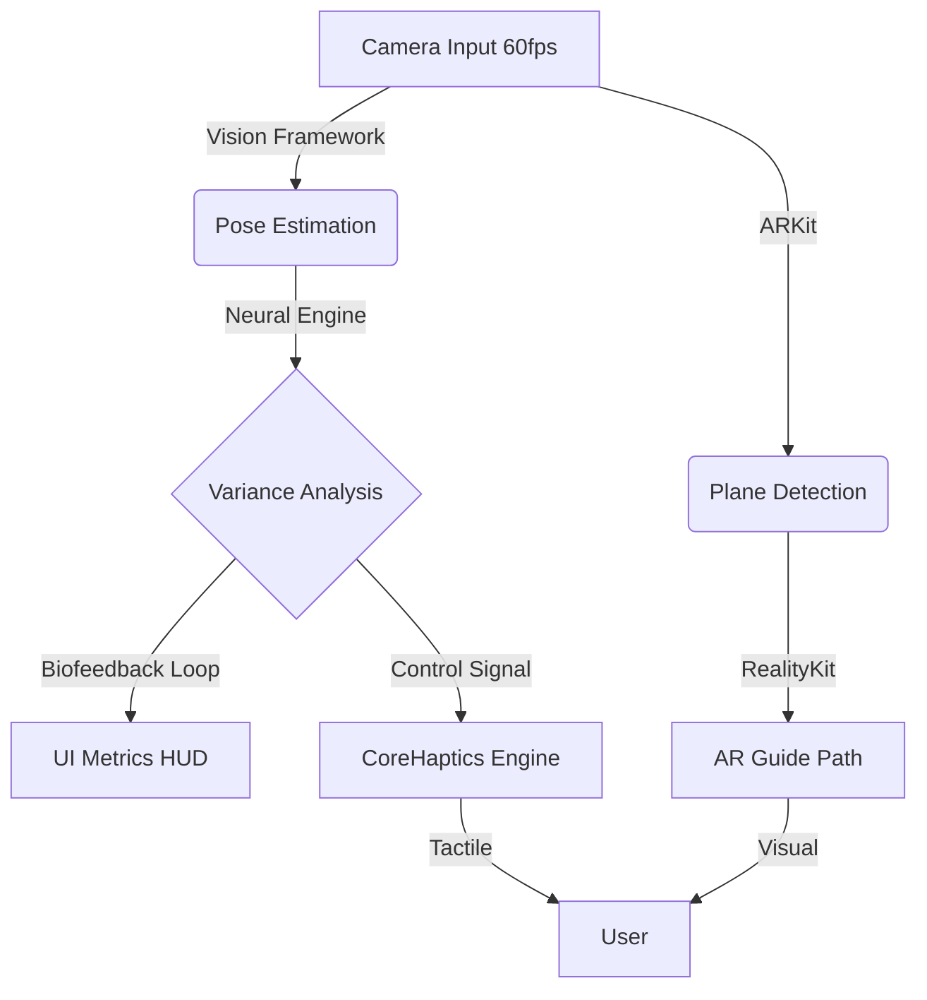

<div align="center">
  
  <h1>Proprio</h1>
  <h3>Restoring Agency through Augmented Perception.</h3>
  <br/>
</div>

**Proprio** is a clinical-grade assistive interface designed to stabilize movement for individuals with **Parkinson’s Disease**, **Essential Tremor**, and **Dyspraxia**. 

It is not a medical device; it is a **neurological anchor**. By closing the loop between visual perception and haptic sensation, it bypasses damaged neural pathways to restore motor autonomy.

---

##  Core Features

### 1. Augmented Gait Stabilization (AGS)
Leveraging **ARKit 6**, Proprio projects a high-contrast, rhythmic "Guide Path" onto the physical floor.
*   **Mechanism:** Uses **Paradoxical Kinesis**—visual cues allow patients with Freezing of Gait (FoG) to step "over" virtual objects when they cannot step "forward."
*   **Tech:** Real-time plane estimation + People Occlusion.

### 2. Haptic Neural Entrainment
Implements **Rhythmic Auditory Stimulation (RAS)** principles via the Taptic Engine.
*   **Mechanism:** Delivers precise, transient haptic pulses (60-120 BPM) to the wrist. This provides an external temporal template, forcing the motor cortex to synchronize and reduce variability.
*   **Tech:** `CoreHaptics` transient events with adjustable sharpness and intensity.

### 3. Real-Time Tremor Quantification
Uses Computer Vision to act as a biofeedback monitor.
*   **Mechanism:** Tracks 19 skeletal keypoints at 60fps to calculate tremor amplitude and gait asymmetry in real-time.
*   **Tech:** `Vision` Framework (`VNDetectHumanBodyPoseRequest`) processed on the Apple Neural Engine (ANE).

---

##  User Manual

### Getting Started
1.  **Launch Proprio:** Ensure you are in a well-lit environment.
2.  **Permissions:** Grant access to **Camera** (for Vision/AR) and **Bluetooth** (if using external accessories, though not required for core features).
3.  **Calibration:** Hold the device steady at chest height for 3 seconds to establish the floor plane.

### Modes of Operation

####  Gait Assistance Mode
*   **Use Case:** Walking difficulties, Freezing of Gait.
*   **Action:** Point the camera at the floor in front of you.
*   **Result:** A green rhythmic path appears. Step on the bars in time with the haptic pulse.

####  Fine Motor Mode (Tremor)
*   **Use Case:** Writing, eating, holding objects.
*   **Action:** Place the device on a stand facing your hands.
*   **Result:** The HUD displays real-time tremor amplitude. Haptic feedback will provide "counter-rhythm" stability cues (experimental).

### Settings & Customization
Tap the **Gear Icon** in the top right to access clinical settings:
*   **BPM (Beats Per Minute):** Adjust the haptic metronome speed (Default: 60 BPM).
*   **Visual Contrast:** Toggle between "High Contrast" (Green/Black) and "AR Blending" modes.

---

##  Clinical Use Cases

| Condition | Challenge | Proprio Solution |
|-----------|-----------|------------------|
| **Parkinson's Disease** | Freezing of Gait (FoG) | Visual cues break the freeze loop via the visual cortex. |
| **Essential Tremor** | Hand instability | Biofeedback allows conscious suppression of tremor amplitude. |
| **Dyspraxia** | Motor planning deficit | Rhythmic entrainment provides a temporal structure for movement. |
| **Stroke Rehabilitation** | Gait asymmetry | Real-time symmetry visualization encourages balanced weight distribution. |

---

##  Technical Architecture

Built exclusively for iOS/iPadOS to leverage the full power of Apple Silicon.



*   **Language:** Swift 5.9
*   **UI:** SwiftUI (Glassmorphic, HIG-compliant)
*   **Concurrency:** `DispatchQueue.global(qos: .userInitiated)` for Vision processing to maintain 60fps AR render loop.

---

##  Installation

### Prerequisites
*   iOS 17.0+ or iPadOS 17.0+
*   Device with A12 Bionic or later (for Neural Engine performance)
*   Xcode 15.2+ (for building from source)

### Build Instructions
1.  Clone the repository:
    ```bash
    git clone https://github.com/Deeven-Seru/proprio.git
    ```
2.  Open `Package.swift` in Xcode.
3.  Select your physical device target.
4.  **Run** (Cmd+R).

> **Note:** Simulator is **not supported** due to hardware dependencies on Camera and Haptic Engine.

---

##  Privacy & Safety

*   **Zero Data Collection:** Proprio processes all video feeds locally on-device. No images or pose data are ever transmitted to the cloud.
*   **Safety Disclaimer:** This app is a tool for **assistance**, not medical diagnosis. Always consult a neurologist for clinical treatment. Use caution when walking with AR devices.

---

**Proprio.** *Strategic Intelligence for Human Movement.*
